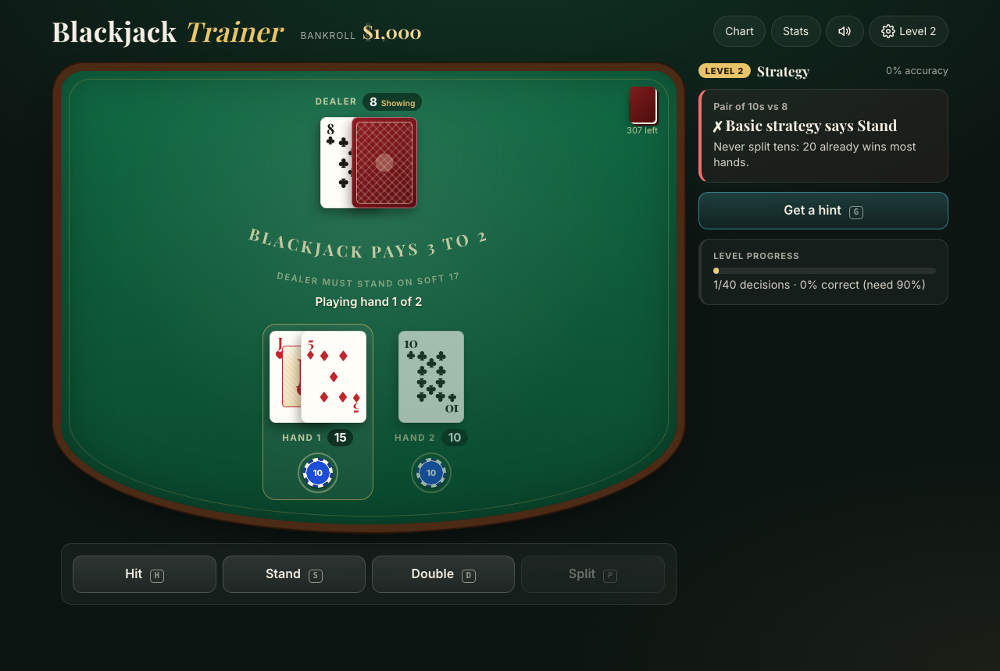
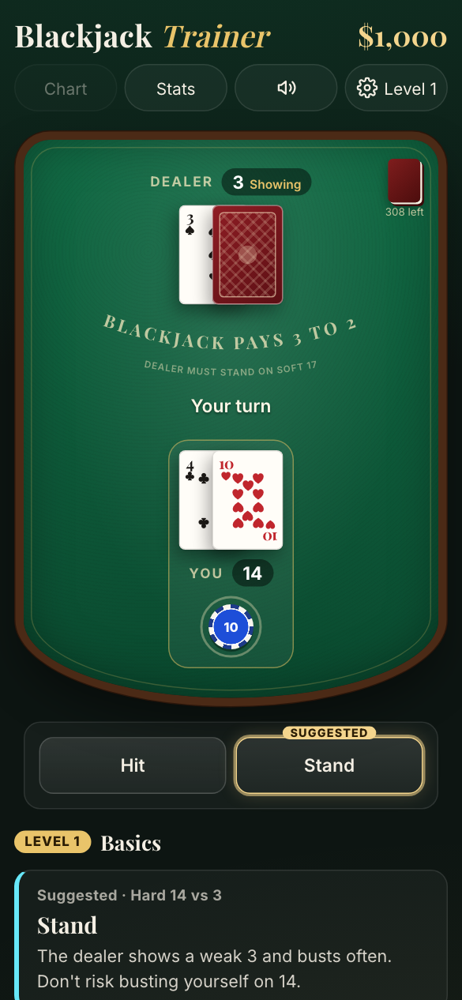

# Blackjack

A blackjack **trainer** for the browser. Learn basic strategy step by step, then practise
card counting, at a table that plays by real casino rules and deals fairly.

<p align="center">
  
  &nbsp;
  
</p>

- **Four learning levels**: Basics (hit or stand, with the right move highlighted) →
  Strategy (double and split) → Full table (insurance, surrender, your own table rules) →
  Counting (Hi-Lo running and true count, count checks)
- **A coach** that grades every decision against basic strategy, explains why in plain
  language, tracks your accuracy and most common mistakes, and suggests when to level up
- **Real rules**: splits (up to 4 hands), double after split, insurance, late surrender,
  4/6/8 decks, dealer stands or hits soft 17, 3:2 or 6:5. Full details in
  [`docs/rules.md`](docs/rules.md)
- **Fair dealing**: cryptographic shuffle, verified by statistical tests and a
  100,000-hand simulation that matches published house-edge figures
- Casino-style table, synthesized sound effects, vibration on phones, screen-reader
  support, and keyboard shortcuts. Your session (including a hand in progress) is saved
  in the browser.
- **Installable and offline**: add it to your home screen and play without a network

## Quick start

```bash
npm install
npm run dev
```

Open the URL Vite prints (usually `http://localhost:5173`). Requires Node 20+.

## Android app

To just install it, download the signed APK from the
[latest release](https://github.com/thundermage117/Blackjack/releases/latest) and open it on
your phone (allow "install unknown apps" when asked).

The trainer also builds as an Android app with [Capacitor](https://capacitorjs.com)
([ADR-0015](docs/adr/0015-android-app-with-capacitor.md)). It needs JDK 21 and the
Android SDK:

```bash
brew install openjdk@21 && brew install --cask android-commandlinetools
export JAVA_HOME=/opt/homebrew/opt/openjdk@21
export ANDROID_HOME="$HOME/Library/Android/sdk"
sdkmanager --sdk_root="$ANDROID_HOME" --licenses

npm run apk   # → apps/web/android/app/build/outputs/apk/release/app-release.apk
```

Release builds are signed with the keystore described in
`apps/web/android/keystore.properties`, which is not in git. Without it you get an
unsigned APK. Increase `versionCode` in `apps/web/android/app/build.gradle` for each release.

## Keyboard shortcuts

| Key       | Action                              |
| --------- | ----------------------------------- |
| `N`       | Deal / next hand                    |
| `H` / `S` | Hit / Stand                         |
| `D` / `P` | Double / Split (from level 2)       |
| `R`       | Surrender (level 3+, when enabled)  |
| `I` / `O` | Take / decline insurance (level 3+) |
| `G`       | Get a hint (level 2+)               |
| `C`       | Strategy chart                      |
| `1` – `4` | Bet $10 / $25 / $50 / $100          |
| `M`       | Sound on / off                      |

Add `?seed=123` to the URL for a reproducible shoe, e.g. to share a hand.

## Commands

| Command             | What it does                                               |
| ------------------- | ---------------------------------------------------------- |
| `npm run dev`       | Start the Vite dev server                                  |
| `npm run build`     | Typecheck and build the web app to `apps/web/dist`         |
| `npm run preview`   | Serve the production build locally                         |
| `npm test`          | Run the Vitest suite (unit, fairness and simulation tests) |
| `npm run test:e2e`  | Playwright end-to-end tests against the production build   |
| `npm run typecheck` | Typecheck packages, tests and the web app                  |
| `npm run lint`      | ESLint                                                     |
| `npm run format`    | Prettier (write); `format:check` to verify only            |
| `npm run check`     | Everything CI runs: format check, lint, typecheck, tests   |

Each one also has a `make` shortcut (`make dev`, `make check`, …). Run `make` to list them.

## Project layout

```
apps/web/              React UI
  src/learning/        levels, trainer, explanations, counting, chart helpers
  src/state/           session reducer, table view, persistence, the game hook
  src/audio/           sound cues, Web Audio synthesizer, haptics
  src/components/      table, cards, chips, coach panel, dialogs
packages/game-core/    cards, rules, round engine, settlement, Hi-Lo counting (pure TS)
packages/hint-engine/  generated strategy tables and lookup (pure TS)
tests/                 Vitest suites, fixtures, simulation helper
e2e/                   Playwright end-to-end tests
docs/                  rules, architecture, strategy format, ADRs, original plans
```

## Documentation

- [Architecture (as built)](docs/architecture.md): module map and the lifecycle of a hand
- [Architecture decision records](docs/adr/README.md): why things are the way they are
- [Rules and acceptance checklist](docs/rules.md)
- [Hint strategy table format](docs/hint-strategy-format.md)
- [Contributing](CONTRIBUTING.md): code style, tests and commit conventions
- [Changelog](CHANGELOG.md)
- Original planning documents (in [`docs/planning/`](docs/planning)):
  [project plan](docs/planning/ProjectPlan.md), [requirements](docs/planning/Requirements.md),
  [specifications](docs/planning/Specifications.md) and PlantUML diagrams

## Deployment

The app builds to static files. `vercel.json` is configured: import the repository into
Vercel and it will run `npm run build` and serve `apps/web/dist`. Any static host works the
same way. Serve it over HTTPS so the service worker (install and offline play) registers.

## Roadmap

### Expand to mobile

- ~~Make the web app installable as a PWA (manifest, icons, offline play via a service
  worker).~~ Done, see [ADR-0014](docs/adr/0014-installable-pwa-with-offline-play.md).
- ~~Wrap it as a native Android app (Capacitor).~~ Done, see
  [ADR-0015](docs/adr/0015-android-app-with-capacitor.md). Still to do: iOS, Play Store
  listing, CI-built releases, native haptics and audio.
- Mobile polish: landscape layout, larger touch targets for split hands, swipe gestures for
  hit/stand.

### Security testing

- Dependency scanning: `npm audit` in CI and automated update PRs (Dependabot).
- Static analysis with GitHub CodeQL.
- Security headers for the hosted site (Content-Security-Policy, HSTS, `X-Content-Type-Options`)
  in `vercel.json`, verified by a test.
- Fuzz the save-file loader (`state/storage.ts`) with random and malicious input.
- Re-assess the threat model before any backend, accounts or leaderboard: the client is
  currently trusted, so a leaderboard would need server-side dealing (see ADR-0002).

## License

See [LICENSE](LICENSE).
