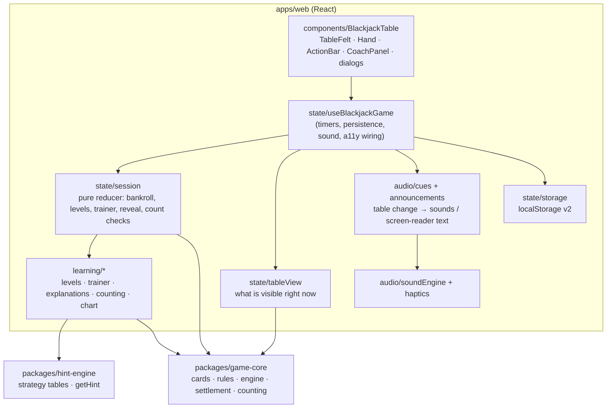
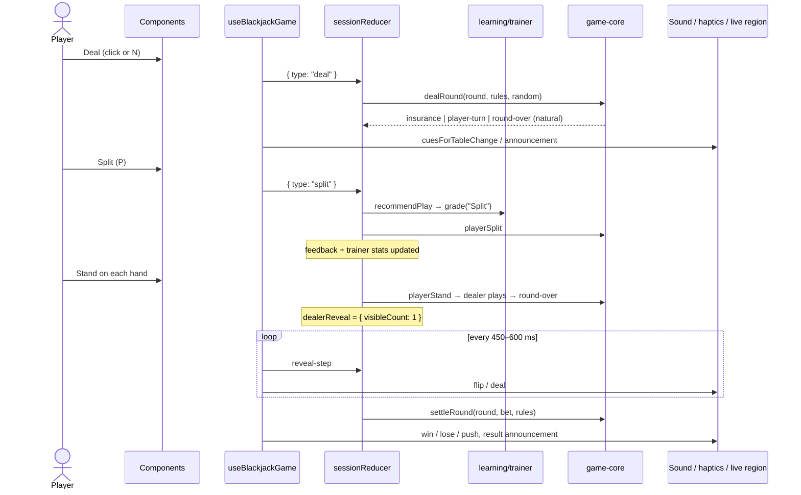

# Architecture (as built)

Last updated: 2026-10-08

This document describes the app as it is actually built. `planning/Specifications.md` and the
PlantUML diagrams next to it describe the originally planned full-stack design.
Where they differ, this document and the [ADRs](adr/README.md) are authoritative.

## Overview

A static single-page app. All game rules, strategy, learning logic and state run in the
browser ([ADR-0002](adr/0002-frontend-only-mvp-with-pure-packages.md)).

## Layers

| Layer                  | Location                                                        | Purity                     | Tested by                                                         |
| ---------------------- | --------------------------------------------------------------- | -------------------------- | ----------------------------------------------------------------- |
| Rules engine           | `packages/game-core`                                            | Pure (injectable `random`) | `tests/game-core.*`                                               |
| Strategy / hints       | `packages/hint-engine`                                          | Pure, generated tables     | `tests/hint-engine.*`                                             |
| Learning               | `apps/web/src/learning`                                         | Pure                       | `tests/web.learning.test.ts`                                      |
| Session reducer        | `apps/web/src/state/session.ts`                                 | Pure                       | `tests/web.session.test.ts`                                       |
| Table view, cues, a11y | `state/tableView.ts`, `audio/cues.ts`, `state/announcements.ts` | Pure                       | `tests/web.sound-cues.test.ts`, `tests/web.announcements.test.ts` |
| Persistence            | `state/storage.ts`                                              | Injectable storage         | `tests/web.storage.test.ts`                                       |
| Fairness               | shuffle, RNG, full simulation                                   |                            | `tests/game-core.fairness.test.ts`                                |
| React wiring, audio    | hook, components, `soundEngine.ts`                              | Effects                    | Playwright `e2e/` + manual                                        |

Rule of thumb: logic that decides **what happens** is pure and unit-tested. Code that
decides **when** (timers) or **how it looks and sounds** lives in the React layer and is
covered end to end.

## Key concepts

- **Rounds have many hands.** `RoundState.playerHands` plus `activeHandIndex` model splits.
  Insurance is its own phase, and late surrender a hand status
  ([ADR-0008](adr/0008-multi-hand-rounds-splits-insurance-surrender.md)).
- **Rules are data.** `createRules(TableOptions)` builds engine rules, and
  `strategyTableFor(...)` builds the matching strategy table
  ([ADR-0009](adr/0009-table-rule-variants-and-strategy-tables.md)).
- **Levels are config.** `rulesForLevel` switches locked actions off in the engine rules,
  so the engine enforces the level and hints never suggest a locked move
  ([ADR-0010](adr/0010-progressive-learning-levels.md)).
- **The trainer grades before acting.** On every decision the reducer asks for the
  recommendation, grades the choice, then applies the action.
- **Atomic engine, staged presentation.** The engine resolves the dealer in one call; the UI
  reveals it card by card ([ADR-0007](adr/0007-staged-dealer-reveal-in-ui-layer.md)).
- **Sound and announcements follow the table.** Both are pure diffs of `TableView`
  ([ADR-0004](adr/0004-synthesized-sound-with-web-audio.md)).
- **Fair by construction and by test.** CSPRNG shuffle, plus statistical tests
  ([ADR-0012](adr/0012-csprng-shuffle-and-fairness-testing.md)).

## A hand, end to end

## Not built yet

- Backend stats API (Express + MongoDB) and the `/api/*` endpoints in `planning/Specifications.md`
- Single- and double-deck strategy
- Hosted deployment: the app is deploy-ready (`vercel.json`) but not connected to a
  Vercel project
