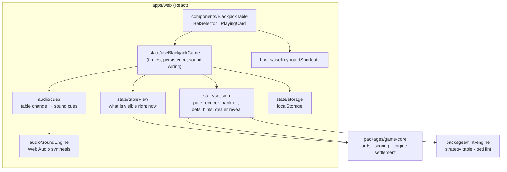
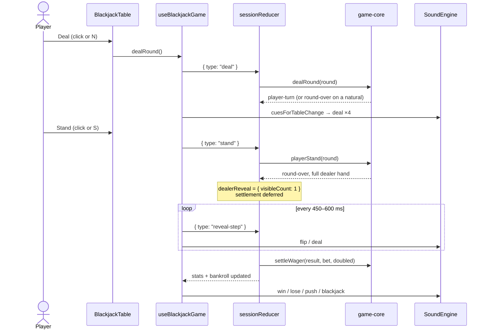

# Architecture (as built)

Last updated: 2026-10-08

This document describes the MVP as it is actually built. `Specifications.md` and the PlantUML
diagrams in the repository root describe the originally planned full-stack design. Where they
differ, this document and the [ADRs](adr/README.md) are authoritative.

## Overview

The MVP is a static single-page app. All game rules, strategy and state run in the browser
([ADR-0002](adr/0002-frontend-only-mvp-with-pure-packages.md)).

## Layers

| Layer               | Location                                            | Purity                     | Tested by                           |
| ------------------- | --------------------------------------------------- | -------------------------- | ----------------------------------- |
| Rules engine        | `packages/game-core`                                | Pure (injectable `random`) | `tests/game-core.*`                 |
| Strategy / hints    | `packages/hint-engine`                              | Pure, data-driven table    | `tests/hint-engine.*`               |
| Session reducer     | `apps/web/src/state/session.ts`                     | Pure                       | `tests/web.session.test.ts`         |
| Table view + cues   | `state/tableView.ts`, `audio/cues.ts`               | Pure                       | `tests/web.sound-cues.test.ts`      |
| Persistence         | `state/storage.ts`                                  | Injectable storage         | `tests/web.storage.test.ts`         |
| React wiring, audio | `useBlackjackGame.ts`, `soundEngine.ts`, components | Effects                    | Manual smoke test (`docs/rules.md`) |

The rule of thumb: logic that decides **what happens** is pure and unit-tested; code that
decides **when** (timers) or **how it looks and sounds** lives in the React layer.

## A hand, end to end

## Key design points

- **Atomic engine, staged presentation.** The engine resolves the dealer's hand in one call.
  The reveal is a UI concern ([ADR-0007](adr/0007-staged-dealer-reveal-in-ui-layer.md)).
- **Bet-agnostic engine.** Money is handled by `settleWager`, outside round state
  ([ADR-0006](adr/0006-bet-agnostic-engine-with-settlement.md)).
- **Sound follows the table, not the buttons.** This keeps audio in sync with animations
  ([ADR-0004](adr/0004-synthesized-sound-with-web-audio.md)).
- **One ruleset, checked in tests.** `DEFAULT_MVP_RULES` (6 decks, S17, 3:2, double on any
  first two cards, reshuffle below 15 cards) must match the strategy table metadata, and
  `tests/hint-engine.table.test.ts` enforces this.

## Not built yet

These come from the project plan and are still open:

- Backend stats API (Express + MongoDB) and the `/api/*` endpoints in `Specifications.md`
- Splits, insurance, surrender
- Hosted deployment. The app is deploy-ready: `vercel.json` is configured, but it needs to
  be connected to a Vercel project.
